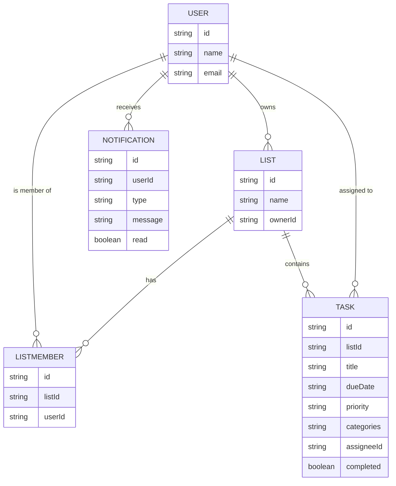

# Domain Model

A user owns lists and can be invited to collaborate on others' lists; each
list holds tasks that carry a due date, priority, and categories/tags, and
can be assigned to any member of the list; members are notified in-app of
invitations and assignments.

- **USER** is the signed-in identity, sourced from Thunder.
- **LIST** has one owner and any number of **LISTMEMBER** rows for its
collaborators.
- **TASK** belongs to one list, optionally assigned to one member, and
carries `categories` as a comma-separated set of tags.
- **NOTIFICATION** records an in-app alert for an invitation or a task
assignment.

