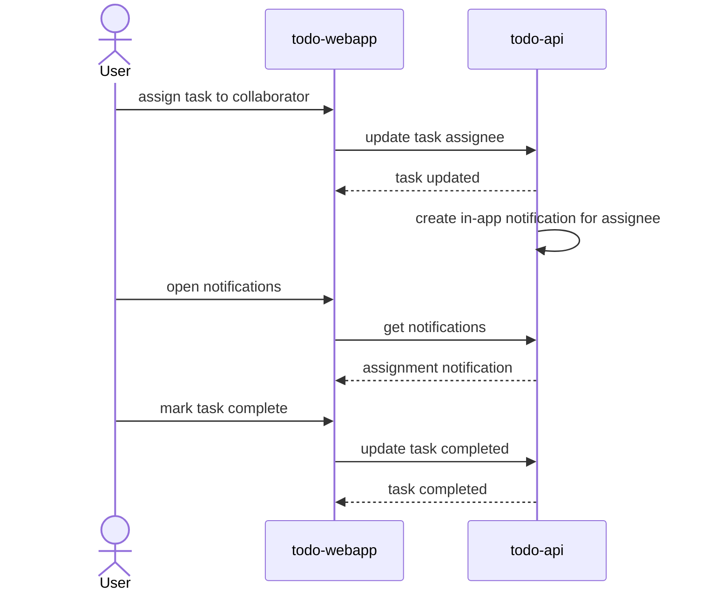

# Assign and complete a task

A User assigns a task on a shared list to a collaborator, who is notified
in-app, views the assigned task, and marks it complete.

```mermaid
sequenceDiagram
    actor User
    participant todowebapp as todo-webapp
    participant todoapi as todo-api

    User->>todowebapp: assign task to collaborator
    todowebapp->>todoapi: update task assignee
    todoapi-->>todowebapp: task updated
    todoapi->>todoapi: create in-app notification for assignee

    User->>todowebapp: open notifications
    todowebapp->>todoapi: get notifications
    todoapi-->>todowebapp: assignment notification

    User->>todowebapp: mark task complete
    todowebapp->>todoapi: update task completed
    todoapi-->>todowebapp: task completed
```

