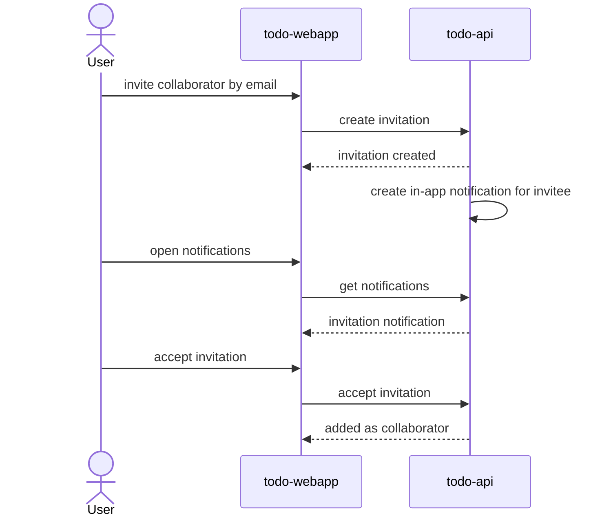

# Invite and join a shared list

A User invites another User to collaborate on a list by email; the invited
User is notified in-app and accepts to join as a collaborator.

```mermaid
sequenceDiagram
    actor User
    participant todowebapp as todo-webapp
    participant todoapi as todo-api

    User->>todowebapp: invite collaborator by email
    todowebapp->>todoapi: create invitation
    todoapi-->>todowebapp: invitation created
    todoapi->>todoapi: create in-app notification for invitee

    User->>todowebapp: open notifications
    todowebapp->>todoapi: get notifications
    todoapi-->>todowebapp: invitation notification

    User->>todowebapp: accept invitation
    todowebapp->>todoapi: accept invitation
    todoapi-->>todowebapp: added as collaborator
```

